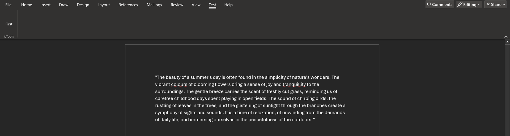
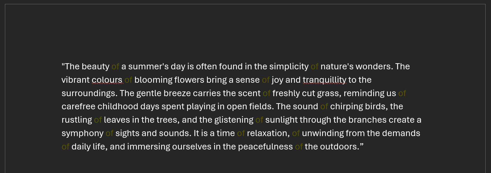
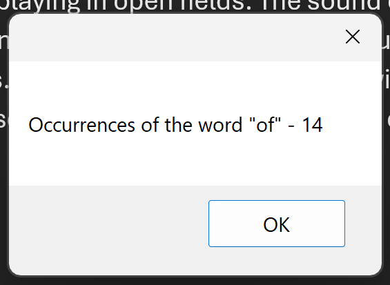

# MS Word Addin (VSTO)


## Description
Microsoft Word add-in, in C# that creates a new ribbon group called “Test” with a button. This group will contain a control to modify the document using the Office API.


Here is the functionality of the button:
- Iterate through all the text in the document, adding a highlight at each instance of the word “of”.


- Display the number of occurrences of the word “of” in a dialog box.


## installation

## Code Explaination

[ribbon.xml](AddinTest/Ribbon.xml) 
this file creates the test tab with the button
```xml
<?xml version="1.0" encoding="UTF-8"?>
<customUI onLoad="Ribbon_Load" xmlns="http://schemas.microsoft.com/office/2006/01/customui">
    <ribbon>
        <tabs>
            <tab idMso="TabAddIns" label="Test">
                <group id="icTools" label="icTools">
                    <button id="firstButton" screentip="first" supertip="Iterate through all the text in the document, adding a highlight at each instance of the word &quot;of&quot;." onAction="OnFirstButton" label="First" size="large" />
                </group>
            </tab>
        </tabs>
    </ribbon>
</customUI>
```
[ThisAddIn.cs](AddInTest/ThisAddIn.cs) creates the main aplication 
```cs
// overrides original ribbon with extra test tab
        protected override Microsoft.Office.Core.IRibbonExtensibility CreateRibbonExtensibilityObject()
        {
            return new Ribbon();
        }
```
[Ribbon.cs](AddInTest/Ribbon.cs) creates the backend for the button click
```cs
 public void OnFirstButton(Office.IRibbonControl control)
        {
            // iterates through all text in document adding highlight at each instance of the word "of"
            Word.Find find = Globals.ThisAddIn.Application.ActiveDocument.Content.Find;
            find.Replacement.Font.ColorIndexBi = Word.WdColorIndex.wdYellow;
            find.Execute(FindText: "of", MatchCase: false, Replace: Word.WdReplace.wdReplaceAll);
            // displays the occurrences of the word of in a dialog box
            Word.Range range = Globals.ThisAddIn.Application.ActiveDocument.Range();
            MessageBox.Show( "Occurrences of the word \"of\" - " + range.Text.Split(' ').Count( word => word.Equals("of") ) );
        }
```